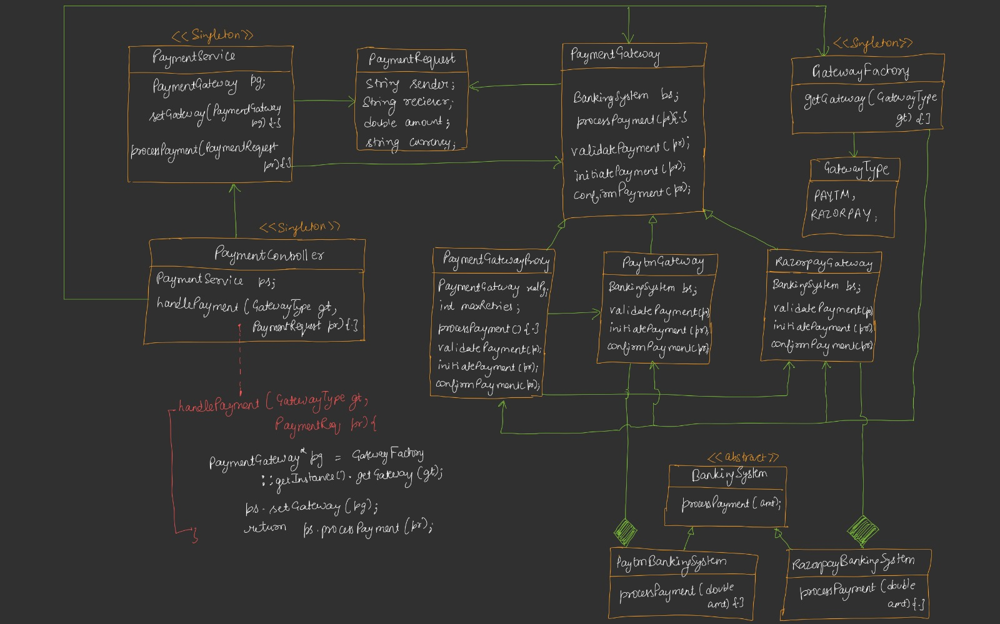
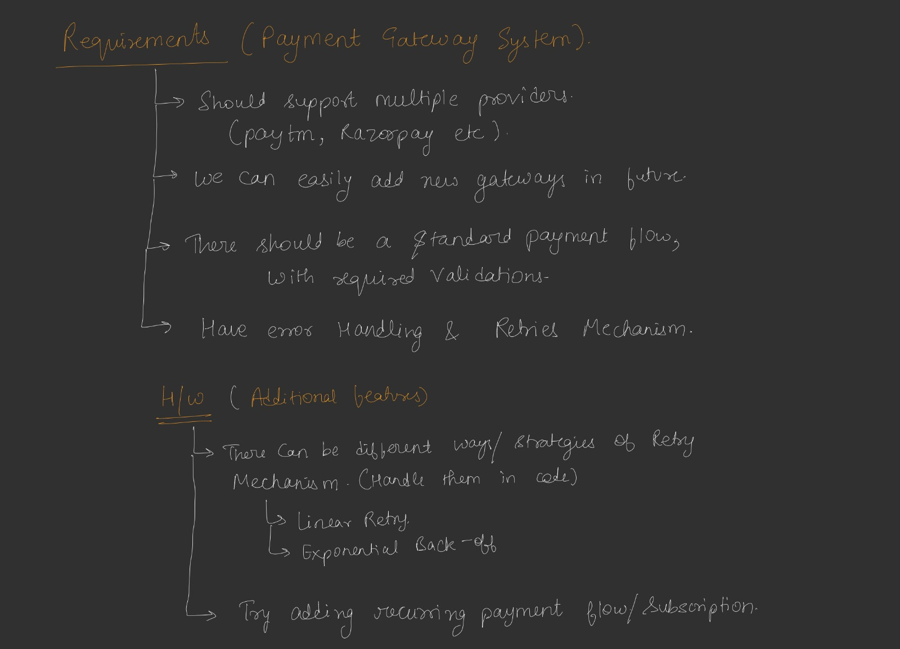

# 💳 Payment Gateway System

A scalable **Payment Gateway System** developed in **C++** following **Low-Level Design (LLD)** principles and industry-standard design patterns.

---

# 🚀 Features

- Multiple Payment Providers
- Paytm Integration
- Razorpay Integration
- Gateway Factory
- Payment Validation
- Retry Mechanism
- Extensible Architecture
- SOLID Principles
- Clean OOP Design

---

# 🏛 Architecture



---

# 📋 Requirements



---

# 🧩 Design Patterns Used

| Pattern | Purpose |
|----------|---------|
| Factory | Creates payment gateways |
| Strategy | Different payment providers |
| Singleton | Single instances |
| Proxy | Retry mechanism |
| Template Method | Standard payment flow |

---

# 📂 Folder Structure

```text
PaymentGatewayApplication/
│
├── PaymentGatewayApplication.cpp
├── README.md
├── .gitignore
└── images
    ├── uml.png
    └── requirements.png
```

---

# ⚙ Payment Flow

```text
User
  │
  ▼
Payment Controller
  │
  ▼
Payment Service
  │
  ▼
Gateway Factory
  │
  ▼
Payment Gateway
  │
  ▼
Banking System
  │
  ▼
Payment Success
```

---

# 🛠 Technologies

- C++
- OOP
- Low Level Design
- Design Patterns

---

# 🎯 Future Scope

- Stripe
- PayPal
- UPI
- Wallet Support
- Payment Logs
- Database Integration

---

# 👨‍💻 Author

**Manav Redhu**

GitHub:
https://github.com/manavredhu

⭐ Star this repository if you like it!
---

## ⭐ If you like this project, consider giving it a Star!
